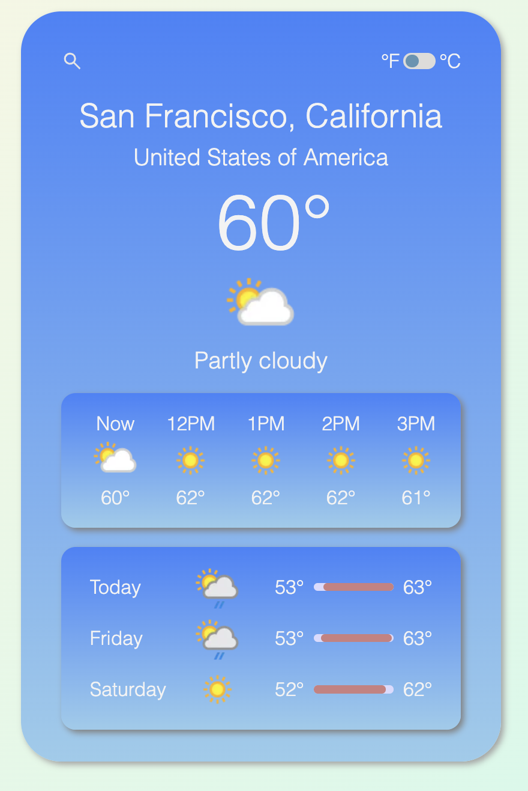

# Weather App

A simple weather application (Apple clone) that allows users to search for current and forecasted weather information by city or airport code.

## Description

The (Apple Clone) Weather App fetches current and forecast weather data from a weather API. Users can search for weather information by entering a city name or airport code. The app displays current weather conditions, hourly weather for the next 24 hours, and a three-day forecast.

## Table of Contents

- [Description](#description)
- [Screenshot](#screenshot)
- [Preview](#preview)
- [Features and Implementation](#features-and-implementation)
- [Installation](#installation)
- [Usage](#usage)
- [Tech Stack](#tech-stack)
- [Dev Notes](#dev-notes)
- [License](#license)
- [Contact Information](#contact-information)

## Screenshot



## Preview

You can view a live preview of the page [here](https://sourdoughbredd.github.io/weather-app/).

## Features and Implementation

- **API Integration**: Fetches current and forecast weather data using the WeatherAPI.
- **Error Handling**: Alerts users if no matching location is found or if there are API errors.
- **Current Weather Display**: Shows the current temperature, condition, and location information.
- **Three-Day Forecast**: Displays weather conditions for the next three days.
- **Responsive Design**: Ensures the app looks good on both desktop and mobile devices.

## Installation

1. Clone the repository:
   ```sh
   git clone https://github.com/sourdoughbredd/weather-app.git
   ```
2. Navigate to the project directory:
   ```sh
   cd weather-app
   ```
3. Open `index.html` in your preferred web browser.

## Usage

- Enter a city name or airport code in the search input field.
- Press Enter or click the search icon to fetch and display the weather information.

## Tech Stack

- HTML
- CSS
- JavaScript

## Dev Notes

If the design looks familiar to you, it's because I went with a clone of the Apple weather app on iPhone so that i wouldn't get bogged down in making design choices. Overall, I'm pretty happy with the result and how quickly I was able to complete it. Working with the Weather API introduced some new challenges, including careful handling of time zone differences and handling of errors returned by the API. The only issue I have with the app currently is that the daily forecast elements don't always align (in space) nicely. This could be fixed pretty easily with some refactoring, but my time is better spent on continuing my learning.

## License

This project is licensed under the MIT License.

## Contact Information

For any questions or suggestions, please contact Brett Bussell at [bwbussell24@gmail.com](mailto:bwbussell24@gmail.com).
